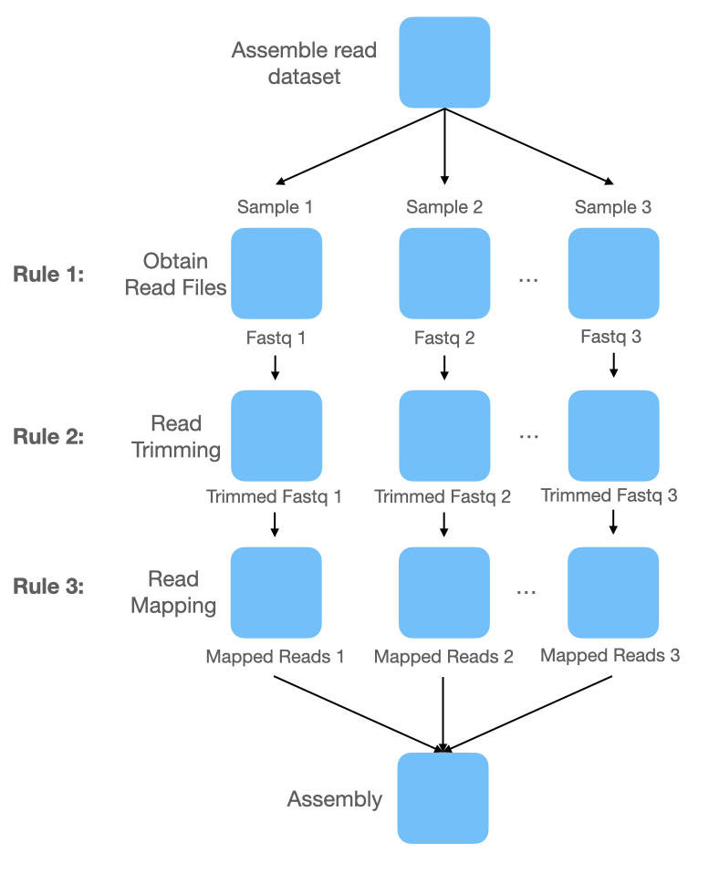
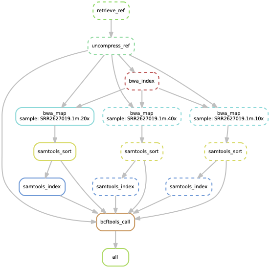

# `A Snakemake workflow building Tutorial`

[](https://snakemake.github.io)


This is a brief introduction to workflow management with snakemake aiming at getting you up and running with snakemake on the [Ibex](https://www.hpc.kaust.edu.sa/ibex) cluster. For a comprehensive documentation check out the links in the [resources](#resources) such as the official [snakemake documentation on readthedocs](https://snakemake.readthedocs.io/en/stable/).


## Table of Content
- [Introduction](#introduction)
- [A simple Snakemake workflow](#a-simple-snakemake-workflow)
- [Separating code from configuration](#separating-code-from-configuration)
- [File Organisation](#file-organisation)
- [Wildcards](#wildcards)
- [Protecting and removing files](#protecting-and-removing-files)
- [CPU allocation](#cpu-allocation)
- [Cluster configuration](#cluster-configuration)
- [Modularity](#modularity)
- [Snakemake Wrapper](#snakemake-wrapper)
- [Anaconda package management in Snakemake](#anaconda-package-management-in-snakemake)
- [Resources](#resources)

## Introduction

Numerous bioinformatics analyses include a set of standard steps to pre-process data. The analysis of sequencing datasets, for example, requires a range of standard steps like quality control, trimming, contamination checks, and mapping. Let's consider a small example of a genome assembly workflow. The workflow can be broken down into separate steps, snakemake calles these rules:
- A rule defines how to obtain a defined output data type from a defined input data type
- A rule definition can contain the name, a set of input and output files, a command to convert the output from the input, additional parameters for the command, and special parameters which are managed by snakemake
- Definition of input, output, or other attributes is not mandatory



A simple bash script pipeline would be sufficient to implement a simple pipeline like this one. However:
- Some steps might take a long time
- Different languages might be necessary for certain steps, requiring the use of other scripts in addition to the bash pipeline
- Workflow structure can be much more complicated depending on how well the employed software is engineered

Snakemake alleviates these issues by automatically inferring the necessary order of steps in a workflow. Starting from the first rule in the snakefile, Snakemake iterates over all rules and determines how the input file for the current rule can be generated by another rule. This is done recursively until all input file sets of all rules can be generated by another rule or are already present in the file system. Python code can be used to determine input files, we will see later how this comes in handy. This procedure yields a directed acyclic graph determining the order in which rules have to be executed. Snakemake allows different command types:
- Bash/shell commands
- Python script (*.py)
- Python inline code
- R script (*.R)
- R markdown file (*.Rmd)


Disclaimer: Sankemake is not the only workflow management tool available, there are more than 300 workflow management systems trying to alleviate these issues [Peter Amstutz et al. (2022): Existing Workflow systems](https://github.com/common-workflow-language/common-workflow-language/wiki/Existing-Workflow-systems)

## A simple Snakemake workflow

- in the simplest case a workflow consists of a single Snakefile that contains all rules
- Snakefiles are python code
- a rule definition looks like this: each rule can have a name, a set of input and output files, and a command to convert the output from the input
- definition of input, output, or other attributes is not mandatory
- Snakemake allows different command types:
    - Bash/shell commands
    - Python script (*.py)
    - Python inline code
    - R script (*.R)
    - R markdown file (*.Rmd)

```python
rule NAME:
    input: "path/to/inputfile", "path/to/other/inputfile"
    output: "path/to/outputfile", "path/to/another/outputfile"
    shell: "somecommand {input} {output}"
```

- how does a simple workflow look like that prepares a reference genome sequence for an variant calling task?
- we will build a small workflow with the following dependencies: bwa mem, samtools, bcftools
- make sure to install these on the local machine where the examples are executed, or load the corresponding modules if on the [Ibex](https://www.hpc.kaust.edu.sa/ibex) cluster environment
- Snakemake defines the _first_ rule in the snakefile as target. It is best practice to define a rule with name "all" at the beginning of the snakefile which defines the desired workflow output as input. As mentioned above, definition of output is not required

```python
rule all:
	input:
              	"resources/ref/GCF_000005845.2_ASM584v2_genomic.fna"

rule retrieve_ref:
        output:
               	"resources/ref/GCF_000005845.2_ASM584v2_genomic.fna.gz"
        shell:
              	"wget -P resources/ref/ ftp://ftp.ncbi.nlm.nih.gov/genomes/all/GCF/000/005/845/GCF_000005845.2_ASM584v2/GCF_000005845.2_ASM584v2_genomic.fna.gz "

rule uncompress_ref:
        input:
              	"resources/ref/GCF_000005845.2_ASM584v2_genomic.fna.gz"
        output:
               	"resources/ref/GCF_000005845.2_ASM584v2_genomic.fna"
        shell:
              	"gunzip {input}"
```
- on the HPC cluster environment [Ibex](https://www.hpc.kaust.edu.sa/ibex) we need to load the necessary modules are loaded via: `module load samtools bwa bcftools`
- we can use Snakemake's "dryrun" option to see if our pipeline resolves jobs as expected: `snakemake --dryrun --snakefile workflow/Snakefile1 ` 
- Snakemake will look for a snakefile with default name (Snakefile, snakefile, workflow/Snakefile, workflow/snakefile), but since we are using a non-default file name we have to specify it using the option "--snakefile" followed by the path to our first [snakefile](workflow/Snakefile1)
- and execute the workflow with `snakemake -j1 --snakefile workflow/Snakefile1`

<details>
  <summary markdown="span">The Snakemake output of a successful run</summary>

```
Building DAG of jobs...
Using shell: /usr/bin/bash
Provided cores: 1 (use --cores to define parallelism)
Rules claiming more threads will be scaled down.
Job counts:
	count	jobs
	1	all
	1	retrieve_ref
	1	uncompress_ref
	3

[Sun Mar 12 14:05:17 2023]
rule retrieve_ref:
    output: resources/ref/GCF_000005845.2_ASM584v2_genomic.fna.gz
    jobid: 2

--2023-03-12 14:05:17--  ftp://ftp.ncbi.nlm.nih.gov/genomes/all/GCF/000/005/845/GCF_000005845.2_ASM584v2/GCF_000005845.2_ASM584v2_genomic.fna.gz
           => resources/ref/GCF_000005845.2_ASM584v2_genomic.fna.gz’
Resolving ftp.ncbi.nlm.nih.gov (ftp.ncbi.nlm.nih.gov)... 130.14.250.11, 130.14.250.13, 2607:f220:41e:250::12, ...
Connecting to ftp.ncbi.nlm.nih.gov (ftp.ncbi.nlm.nih.gov)|130.14.250.11|:21... connected.
Logging in as anonymous ... Logged in!
==> SYST ... done.    ==> PWD ... done.
==> TYPE I ... done.  ==> CWD (1) /genomes/all/GCF/000/005/845/GCF_000005845.2_ASM584v2 ... done.
==> SIZE GCF_000005845.2_ASM584v2_genomic.fna.gz ... 1379902
==> PASV ... done.    ==> RETR GCF_000005845.2_ASM584v2_genomic.fna.gz ... done.
Length: 1379902 (1.3M) (unauthoritative)

100%[======================================================================================================================================>] 1,379,902   1.09MB/s   in 1.2s

2023-03-12 14:05:21 (1.09 MB/s) - resources/ref/GCF_000005845.2_ASM584v2_genomic.fna.gz’ saved [1379902]

[Sun Mar 12 14:05:21 2023]
Finished job 2.
1 of 3 steps (33%) done

[Sun Mar 12 14:05:21 2023]
rule uncompress_ref:
    input: resources/ref/GCF_000005845.2_ASM584v2_genomic.fna.gz
    output: resources/ref/GCF_000005845.2_ASM584v2_genomic.fna
    jobid: 1

[Sun Mar 12 14:05:21 2023]
Finished job 1.
2 of 3 steps (67%) done

[Sun Mar 12 14:05:21 2023]
localrule all:
    input: resources/ref/GCF_000005845.2_ASM584v2_genomic.fna
    jobid: 0

[Sun Mar 12 14:05:21 2023]
Finished job 0.
3 of 3 steps (100%) done
```

</details>

- one convenient feature is that Snakemake keeps track of output files and does not execute jobs if the output already exists
- running Snakemake a second time will yield this message

```
> Building DAG of jobs...
> Nothing to be done.
```
- this can be overwritten by the "-f" flag to force Snakemake to rerun the requested rules

## Separating code from configuration

In order to change variables easily, instead of updating each rule, it is much more convenient to create a configuration file with all these values. This can be done via a configuration file in [YAML](https://yaml.org/) or [Json](https://www.json.org/json-en.html) format.
In our example, a yaml file in the config folder [config/config.yaml](config/config.yaml) provides the URL to the selected reference sequence and its local storage path. In cases where many parameters for different parts of the workflow are stored in the configuration file, it is a good idea to group parameters by their category. Here we store all reference-related values under the term "reference":

```python
reference:
    refPath: "resources/ref/"
    refLink: "ftp://ftp.ncbi.nlm.nih.gov/genomes/all/GCF/000/005/845/GCF_000005845.2_ASM584v2/GCF_000005845.2_ASM584v2_genomic.fna.gz"
```

The config file can then be loaded in the [workflow/Snakefile2](workflow/Snakefile2) and its values can be accessed via the config variable:

```python
configfile: "config/config.yaml"

rule all:
	input:
              	config["reference"]["refPath"] + "GCF_000005845.2_ASM584v2_genomic.fna"

rule retrieve_ref:
        output:
               	config["reference"]["refPath"] + "GCF_000005845.2_ASM584v2_genomic.fna.gz"
        params:
            reflink = config["reference"]["refLink"],
            path = config["reference"]["refPath"]
        shell:
              	"wget -P {params.path} {params.reflink} "

rule uncompress_ref:
        input:
              	config["reference"]["refPath"] + "GCF_000005845.2_ASM584v2_genomic.fna.gz"
        output:
               	config["reference"]["refPath"] + "GCF_000005845.2_ASM584v2_genomic.fna"
        shell:
              	"gunzip {input}"
```

## File Organisation

When splitting up the workflow into multiple files proper organisation becomes very important for readability and maintainability. This is the file structure recommended by the authors:
- `resources`: input data
- `results`: workflow output 
- [workflow](workflow): main snakemake files
- [workflow/rules](workflow/rules): snakefiles of rules organised by topic
- [workflow/envs](workflow/envs): anaconda environment definition files
- [workflow/scripts](workflow/envs): external scripts 
- "workflow/notebooks": [Jupyter](https://jupyter.org/) notebooks that can be used as command in rule definition
- "workflow/reports": description files for report generation
- [config](config): configuration files for the workflow

The example workflows presented here adhere to this structure with one exception, since we are implementing multiple versions of the workflow in a single repository instead of splitting them into individual repositories.

```
├── .gitignore
├── README.md
├── LICENSE.md
├── workflow
│   ├── rules
|   │   ├── module1.smk
|   │   └── module2.smk
│   ├── envs
|   │   ├── tool1.yaml
|   │   └── tool2.yaml
│   ├── scripts
|   │   ├── script1.py
|   │   └── script2.R
│   ├── notebooks
|   │   ├── notebook1.py.ipynb
|   │   └── notebook2.r.ipynb
│   ├── report
|   │   ├── plot1.rst
|   │   └── plot2.rst
|   └── Snakefile
├── config
│   ├── config.yaml
│   └── some-sheet.tsv
├── results
└── resources
```

## Wildcards

The previous examples include only hard-coded file names. This would be a problem when processing datasets with many input files / samples / replicates /... Snakemake features a powerful mechanism to generalize a workflow from a fixed input file set to an arbitrarily large number of files.
Let's have a look at a Snakemake workflow to call variants on an flexible number of samples. First, we need to download read data for three samples into the folder ./resources/reads. Simply run the bash script "getReads.sh" like this:
```
bash scripts/getReads.sh
```

The main snakefile is named [workflow/Snakefile3](workflow/Snakefile3) and can be executed with the following command:
```
snakemake --snakefile workflow/Snakefile3 -j1
```
Some notes on the implementation:
- [config/config2.yaml](config/config2.yaml) holds the path to the read data we have just downloaded
- the read data samples consist of a pair of fastq files containing the forward ("R1") and reverse ("R2") reads
- the command `SAMPLES = {f.replace('R1.fq.gz','') for f in os.listdir(config["reads"]["path"]) if f.endswith("R1.fq.gz")}` creates a set of all sample names
- the rule `bcftools_call` makes use of the helper function "expand" which allows us to collect the bam files for all available samples in the "SAMPLES" set and provide them collectively to `bcftools mpileup`
- `bwa_index` uses a similar but more specialized helper function to collect the output files of the bwa index function which produces a set of output files which differ only by extension

```python
configfile: "config2.yaml"

SAMPLES = {f.replace('R1.fq.gz','') for f in os.listdir(config["reads"]["path"]) if f.endswith("R1.fq.gz")}

rule all:
	input:
              	config["output"] + "calls/all.vcf"

rule retrieve_ref:
        output:
               	config["reference"]["refPath"] + "GCF_000005845.2_ASM584v2_genomic.fna.gz"
        params:
            reflink = config["reference"]["refLink"],
            path = config["reference"]["refPath"]
        shell:
              	"wget -P {params.path} {params.reflink} "

rule uncompress_ref:
        input:
              	config["reference"]["refPath"] + "GCF_000005845.2_ASM584v2_genomic.fna.gz"
        output:
               	config["reference"]["refPath"] + "GCF_000005845.2_ASM584v2_genomic.fna"
        shell:
              	"gunzip {input}"
rule bwa_index:
    input:
               	config["reference"]["refPath"] + "GCF_000005845.2_ASM584v2_genomic.fna"
    output:
          	multiext(config["reference"]["refPath"] + "GCF_000005845.2_ASM584v2_genomic.fna", ".bwt",".sa",".amb",".ann",".pac")
    shell:
        "bwa index {input}"

rule bwa_map:
    input:
        ref = config["reference"]["refPath"] + "GCF_000005845.2_ASM584v2_genomic.fna",
        ind = config["reference"]["refPath"] + "GCF_000005845.2_ASM584v2_genomic.fna.bwt",
        in1 = config["reads"]["path"] + "{sample}R1.fq.gz",
        in2 = config["reads"]["path"] + "{sample}R2.fq.gz"
    output:
        config["output"] + "mapped_reads/{sample}.bam"
    shell:
        "bwa mem {input.ref} {input.in1} {input.in2} | samtools view -Sb - > {output}"


rule samtools_sort:
    input:
        config["output"] + "mapped_reads/{sample}.bam"
    output:
        config["output"] + "sorted_reads/{sample}.bam"
    shell:
        "samtools sort -T sorted_reads/{wildcards.sample} "
        "-O bam {input} > {output}"

rule samtools_index:
    input:
        config["output"] + "sorted_reads/{sample}.bam"
    output:
        config["output"] + "sorted_reads/{sample}.bam.bai"
    shell:
        "samtools index {input}"

rule bcftools_call:
    input:
        ref= config["reference"]["refPath"] + "GCF_000005845.2_ASM584v2_genomic.fna",
        bam=expand(config["output"] + "sorted_reads/{sample}.bam", sample=SAMPLES),
        bai=expand(config["output"] + "sorted_reads/{sample}.bam.bai", sample=SAMPLES)
    output:
        config["output"] + "calls/all.vcf"
    shell:
        "bcftools mpileup -f {input.ref} {input.bam} | "
        "bcftools call -mv - > {output}"
```


Snakemake provides the option to visualize the directed acyclic graph of the workflow, which can be turned into a simple grapic using this command `snakemake --snakefile workflow/Snakefile3 -j1 --dag | dot -Tpdf > snakemake_variantCalling_dag.pdf`



## Protecting and removing files

Many workflows require very large files in intermediate steps which can be discarded once the next step has been performed (bam, vcf, ...). Such files can be marked as "temporary", allowing snakemake to remove them as soon as all rules with the respective input are completed.
Other result files require a large amount of computation and are thus expensive to recreate if deleted accidentally, e.g. when re-running a snakemake pipeline with updated but unchanged input files. Again, snakemake allows the annotation as "protected", which prevents these files from deletion.

```python
    output:
        temp("path/to/temp_outputfile")
        protected("path/to/protected_outputfile")
```

## CPU allocation

Many tools need to be run multi-threaded to optimize processing time. We can modify the `bwa_map` rule to increase mapping speed using 4 threads instead of 1 as shown below. Importantly, `threads` is not a regular parameter since Snakemake actively manages the number of threads based on the number of cores available on the actual machine it is executed on.

```python
rule bwa_map:
    input:
        ref = config["reference"]["refPath"] + "GCF_000005845.2_ASM584v2_genomic.fna",
        ind = config["reference"]["refPath"] + "GCF_000005845.2_ASM584v2_genomic.fna.bwt",
        in1 = config["reads"]["path"] + "{sample}R1.fq.gz",
        in2 = config["reads"]["path"] + "{sample}R2.fq.gz"
    output:
        config["output"] + "mapped_reads/{sample}.bam"
    threads: 4
    shell:
        "bwa mem  -t {threads} {input.ref} {input.in1} {input.in2} | samtools view -Sb - > {output}"
```


## Cluster configuration

Snakemake can use a HPC cluster to distribute the execution of a workflow. To use a slurm cluster like [Ibex](https://www.hpc.kaust.edu.sa/ibex), one can provide the necessary parameters for sucessful job submission as parameter for each rule:

```python
rule:
    input: ...
    output: ...
    resources:
        partition: <partition name>
        runtime: <some number>
```

Alternatively, one can use the generic cluster support via the "--cluster" parameter and implement the slurm submission command. [Ibex](https://www.hpc.kaust.edu.sa/ibex) requires the specification of the maximum run time for each job and terminates jobs that occupy more than the requested number of CPUs and memory during runtime. We thus need to provide these parameters with the appropriate values for each job of the workflow:

```bash
snakemake --snakefile workflow/Snakefile1 --jobs 10 \
--cluster "sbatch --time {cluster.time} --nodes 1 --ntasks 1 --mem {cluster.mem} --cpus-per-task {cluster.cpus} --job-name={cluster.name}" \
--cluster-config config/cluster.yaml
```

The default resources requested for each job can be specified in the [config/cluster.yaml](config/cluster.yaml) or Json file using the section name `__default__`. Each rule that requires a deviating resource allocation can then be added in a separate section using the rule's name.

```
__default__ :
    time: "30:00"
    cpus: "1"
    mem: "5000"
    name: "hh.{rule}.{wildcards}"

bwa_map:
  cpus: "4"
  mem: "5000"
  time: "30:00"
```

## Modularity

With a growing number of steps snakefiles can quickly get long and hard to read. To alleviate that we can separate sets of rules and keep them in another snakefile which can then be included in the main snakefile using the "include" command. In our example workflow, we can separate rules for reference preparation, read mapping, and variant calling into three separate snakefiles which we can then include in the main file [workflow/Snakefile4](workflow/Snakefile4), improving it's readability:

```python
configfile: "config/config2.yaml"

SAMPLES = {f.replace('R1.fq.gz','') for f in os.listdir('resources/reads') if f.endswith("R1.fq.gz")}

rule all:
	input:
		config["output"] + "calls/all.vcf"

include: "rules/reference.smk"
include: "rules/mapping.smk"
include: "rules/variantCalling.smk"

```

## Snakemake Wrapper

Many standard steps for bioinformatics pipelines are already implemented as standardized wrapper: [snakemake-wrappers on readthedocs](https://snakemake-wrappers.readthedocs.io/en/stable/). Instead of implementing the method call, only parameter adjustment is required to integrate new steps into a workflow. As example, we can rewrite the `samtools_index` rule like this:

```python
rule samtools_index:
    input:
        config["output"] + "sorted_reads/{sample}.bam"
    output:
        config["output"] + "sorted_reads/{sample}.bam.bai"
    wrapper:
        "0.74.0/bio/samtools/index"
```

## Anaconda package management in Snakemake

[Conda](https://docs.conda.io/en/latest/) is a multi-platform open source package management system and environment management system. Conda creates and manages environments on your local computer that provide a wide range of software packages. Environments and packages are installed in the working directory without requiring any admin/root priviledges. Snakemake can automatically create the defined environment in the working directory and execute the specific rules with the environment loaded. Here we provide an example with an environment configuration file [workflow/envs/tutorial_env.yaml](workflow/envs/tutorial_env.yaml):

```yaml
channels:
 - bioconda
 - conda-forge
 - defaults
dependencies:
 - bwa
 - bcftools
 - samtools
 ```

We need to inform Snakemake which rules are depending on this environment, adding a "conda" parameter to the rule definition, such as for the `samtools_index` rule in the snakefile [workflow/rules/mapping.smk](workflow/rules/mapping.smk):

```
rule samtools_index:
    input:
        config["output"] + "sorted_reads/{sample}.bam"
    output:
        config["output"] + "sorted_reads/{sample}.bam.bai"
    conda:
        "../envs/tutorial_env.yaml"
    shell:
        "samtools index {input}"
```

Finally, we need to add the parameter `--use-conda` to the snakemake call: 

```
snakemake --snakefile workflow/Snakefile4 -j1 --use-conda
``` 

and snakemake will automatically create the defined environment in the .snakemake folder in the working directory and execute the specific rules with the environment loaded.

# Resources

- the original snakemake paper: [The snakemake paper on f1000 research](https://f1000research.com/articles/10-33/v2)
- a comprehensive documentation for snakemake: [snakemake tutorial on readthedocs](https://snakemake.readthedocs.io/en/stable/)
- a template for a new snakemake workflow: [snakemake workflows template](https://github.com/snakemake-workflows/snakemake-workflow-template)
- already implemented workflows: [Snakemake Workflow Catalog](https://snakemake.github.io/snakemake-workflow-catalog/?usage=<owner>%2F<repo>)
- [Nextera as commercial alternative](https://www.nextflow.io/docs/latest/index.html)
- [Reproducible, scalable, and shareable analysis pipelines with bioinformatics workflow managers, Wratten, 2021, Nat.Methods](https://www.nature.com/articles/s41592-021-01254-9)

